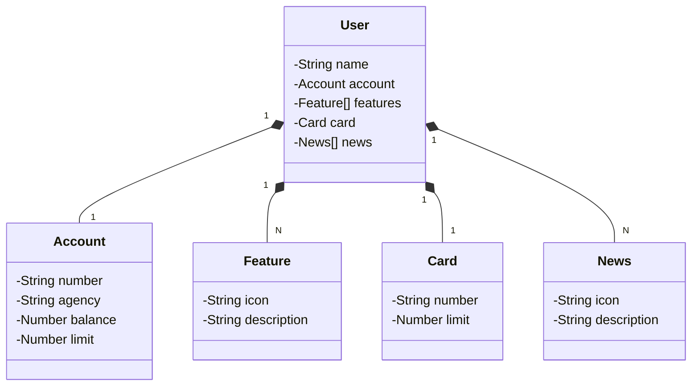

# Santander Dev Week 2023

Java RESTful API criada para a Santander Dev Week.

## Principais Tecnologias

- **Java 17**: Utilizaremos a versão LTS mais recente do Java para tirar vantagem das últimas inovações que essa
  linguagem robusta e amplamente utilizada oferece;
- **Spring Boot 3**: Trabalharemos com a mais nova versão do Spring Boot, que maximiza a produtividade do desenvolvedor
  por meio de sua poderosa premissa de autoconfiguração;
- **Spring Data JPA**: Exploraremos como essa ferramenta pode simplificar nossa camada de acesso aos dados, facilitando
  a integração com bancos de dados SQL;
- **OpenAPI (Swagger)**: Vamos criar uma documentação de API eficaz e fácil de entender usando a OpenAPI (Swagger),
  perfeitamente alinhada com a alta produtividade que o Spring Boot oferece;
- **Railway**: facilita o deploy e monitoramento de nossas soluções na nuvem, além de oferecer diversos bancos de dados
  como serviço e pipelines de CI/CD.

## [Link do Figma](https://www.figma.com/file/0ZsjwjsYlYd3timxqMWlbj/SANTANDER---Projeto-Web%2FMobile?type=design&node-id=1421%3A432&mode=design&t=6dPQuerScEQH0zAn-1)

O Figma foi utilizado para a abstração do domínio desta API, sendo útil na análise e projeto da solução.

## Link da api:  https://sdw-2023-api-prd-6228.up.railway.app/swagger-ui/index.html

## Gerando Diagrama de classe com ChatGpt

Prompt usado:

Gere um diagrama de classes (usando a sintaxe Mermaid) tendo em vista o seguinte JSON que representa um usuário d eum
banco. Mantenha uma estrutura simples e fiel ao modelo que vou passar. Além disso, mantenha o nome das classes em
inglês.

Estrutura Json:

```json
{
  "id": 1,
  "name": "Name User",
  "account": {
    "id": 1,
    "number": "01.097954-4",
    "agency": "2030",
    "balance": 624.12,
    "limit": 1000
  },
  "card": {
    "id": 1,
    "number": "xxxx xxxx xxxx 1111",
    "limit": 2000
  },
  "features": [
    {
      "id": 1,
      "icon": "URL",
      "description": "Descrição da feature"
    }
  ],
  "news": [
    {
      "id": 1,
      "icon": "URL",
      "description": "Descrição da feature"
    }
  ]
}
```

## Diagrama de Classes (Domínio da API)



### Explicação do application-dev.yml

```yaml
spring:
  datasource:
    url: jdbc:h2:mem:sdw2023
    username: sdw2023
    password:
  jpa:
    show-sql: true
    open-in-view: false
    hibernate:
      ddl-auto: create # validate | update | create | create-drop
    properties:
      hibernate:
        format_sql: true
  h2:
    console:
      enabled: true
      path: /h2-console
      settings:
        trace: false
        web-allow-others: false
```

OBS.: Validar a sintaxe do yml caso tenha erro :)

### Explicação Detalhada:

- `spring.datasource`: Configurações relacionadas ao banco de dados.
    - `url`: A URL JDBC para o banco de dados H2 em memória.
    - `username`: Nome de usuário para acessar o banco de dados.
    - `password`: Senha para acessar o banco de dados (deixado em branco, ou seja, sem senha).

- `spring.jpa`: Configurações específicas para o JPA e o Hibernate.
    - `show-sql`: Quando `true`, as consultas SQL geradas serão exibidas no console.
    - `open-in-view`: Quando `false`, desabilita a prática de manter a sessão Hibernate aberta durante a renderização da
      view, o que pode prevenir problemas de gerenciamento de sessão em aplicações web.
    - `hibernate.ddl-auto`: Controla a estratégia de gerenciamento de schema do banco de dados:
        - `validate`: Apenas valida o schema existente.
        - `update`: Atualiza o schema, aplicando mudanças incrementais.
        - `create`: Cria o schema do zero a cada inicialização.
        - `create-drop`: Cria o schema ao iniciar e o remove ao finalizar.
    - `properties.hibernate.format_sql`: Quando `true`, formata as instruções SQL geradas para melhor legibilidade.

- `spring.h2.console`: Configurações para o console web do H2.
    - `enabled`: Quando `true`, habilita o console web do H2.
    - `path`: Define o caminho para acessar o console web do H2.
    - `settings.trace`: Quando `false`, desabilita o rastreamento detalhado (útil para depuração).
    - `settings.web-allow-others`: Quando `false`, restringe o acesso ao console web do H2 apenas para conexões locais.

### Definindo a variável de ambiente do profile de trabalho no intelliI IDEA

> Edit configuration(Run/Debug configuration) > Profile:
> SPRING_PROFILES_ACTIVE=dev
> | ou só dev (ultimate)

### Criar o serviço do banco de dados postgresql
- basta escolher a opção do banco no site e esperar gerar, para poder 
pegar as variáveis para dar continuidade nas configurações.

### Configurações necessário para o deploy no Railway no nosso projeto

- 1° - No arquivo `build.gradle` adicionar a configuração;
   ```gradle
    tasks.jar{
       manifest {
            attributes["Main-Class"] = "br.com.uanderson.santanderdevweek.Application"
       }
    } 
  ```
  
- 2° - Criar o arquivo `Procfile` na raiz do proejto sem extensão mesmo e adicionar:
  - web: java -jar caminha-do-arquivo.jar gerado pelo `build > bootJar`
    ```
     web: java -jar build/libs/springboot-santander-dev-week-2023-0.0.1-SNAPSHOT.jar
    
    ```
- 3° - Tivemos que alterar a versão do gradle de 8.x.x para a 7.6.1
    - Acesse: `gradle/wrapper/gradle-wrapper.properties` e faça a modificação em:
```
distributionUrl=https\://services.gradle.org/distributions/gradle-7.6.1-bin.zip
```
- 4° - Correção de CORS por causa do Swagger
  - Acrescente a seguinte anotação do Swagger na class principal: 
  
```java
@OpenAPIDefinition(servers = { @Server(url = "/", description = "Default Server URL")})
@SpringBootApplication
public class Application {
    public static void main(String[] args) {
        SpringApplication.run(Application.class, args);
    }

}
```
5° - Quando subir pela primeira vez mudar o  `ddl-auto: validate` | update | create | create-drop
```
spring:
  datasource:
    url: jdbc:postgresql://${PGHOST}:${PGPORT}/${PGDATABASE}
    username: ${PGUSER}
    password: ${PGPASSWORD}
  jpa:
    open-in-view: false
    hibernate:
      ddl-auto: validate
```

### Diferenciar perfil de DEFAULT x DEV x PRD  no railway
 - Nosso projeto já tẽm os arquivos `application-dev.yml | application-prd.yml`
 - Então basta fazer a configuração das variáveis do banco geradas pelo railway 
no perfil desejado, no caso o de produção:

```yml
spring:
  datasource:
    url: jdbc:postgresql://${PGHOST}:${PGPORT}/${PGDATABASE}
    username: ${PGUSER}
    password: ${PGPASSWORD}
  jpa:
    open-in-view: false
    hibernate:
      ddl-auto: validate
```
 - ### Variavéis de ambiente na IDE:
> Edit configuration(Run/Debug configuration) > Profile:
> SPRING_PROFILES_ACTIVE=prd (Ativar as variaveis de ambientes > 'modify options')
```
PGDATABASE=nome_do_banco_de_dados;
PGHOST=seu_host_aqui;
PGPASSWORD=sua_senha_aqui;
PGPORT=sua_porta_aqui;
PGUSER=seu_usuario_aqui;
SPRING_PROFILES_ACTIVE=seu_perfil_ativo_aqui;

```
- ### Variavéis de ambiente no projeto no Railway, sem ` ; ` :
```
PORT=seu_porta_aqui
PGDATABASE=nome_do_banco_de_dados
PGHOST=seu_host_aqui
PGPASSWORD=sua_senha_aqui
PGPORT=sua_porta_aqui
PGUSER=seu_usuario_aqui
SPRING_PROFILES_ACTIVE=seu_perfil_ativo_aqui (configurar como variável compartilhada 'Shared Variables')
```
